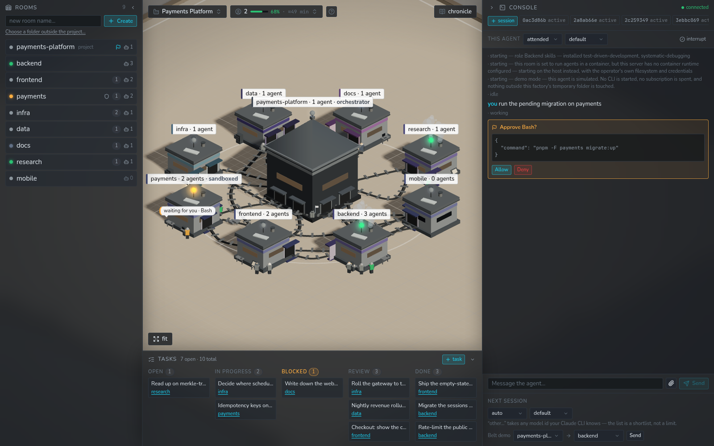
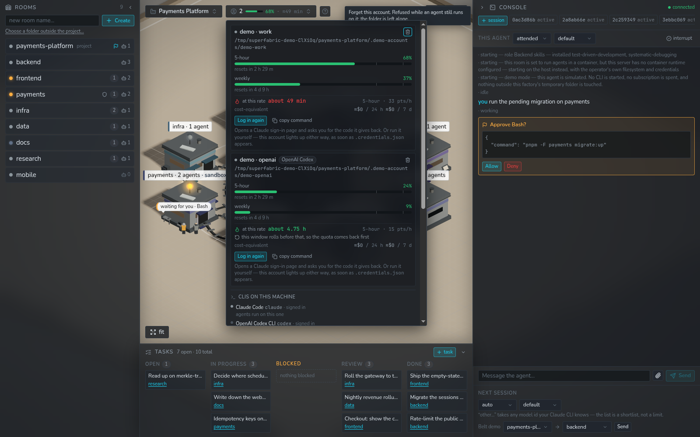
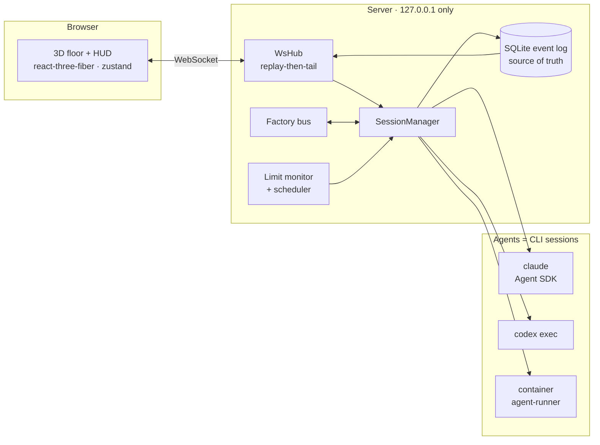

<div align="center">

# SuperFabric

**Your repository as a factory floor — a self-hosted 3D orchestrator for teams of coding agents.**

[](LICENSE)
[](#tests)
[](https://bun.sh)
[](https://nodejs.org)
[](#providers)
[](#security)

[Try the demo](#try-it-in-one-command) · [Quickstart](#quickstart) · [How it works](#how-it-works) · [Docs](#documentation) · [🇷🇺 Русский](README.ru.md)



<sub>The screenshot is <code>pnpm demo</code> — a seeded factory that simulates everything and reaches no real CLI.</sub>

</div>

---

## What this is

You point SuperFabric at a project you already have. It becomes an isometric floor: the central
building is the repository, the workshops around it are **rooms** — which are *folders* — and the
figures inside them are **agents**, real `claude` or `codex` sessions working in those folders.
Conveyor belts carry messages between departments. A board along the bottom holds the work.

Nothing about your repository changes. Take SuperFabric away and what is left is the same ordinary
git repository, with a `CLAUDE.md` in each room folder and, if agents recorded any, some ADRs in
`docs/decisions/`.

```
your-project/          ← the central building
├── CLAUDE.md          ← the factory's charter
├── backend/           ← a room. an agent works here.
│   └── CLAUDE.md      ← that department's charter
├── frontend/          ← a room
└── docs/decisions/    ← what the agents decided, and why
```

## Try it in one command

```bash
pnpm install && pnpm demo
```

A factory of eight rooms and twelve agents builds itself, and starts working: cards move across the
board, packages travel the belts, chimneys smoke over rooms that are busy, one agent waits on an
approval you can answer, one is held by a rate limit and counting down.

**It cannot reach a real CLI.** In demo mode the only executor is the simulator — no process is
spawned, no subscription is spent, and the whole factory lives in a temp directory that is thrown
away when you stop it. Every agent's log opens by saying so.

<div align="center">

<br>
<sub>Per-account limits, a burn rate that says <em>“about 49 min”</em> — or <em>unknown</em> when the history is too thin to say.</sub>
</div>

## Why it exists

| | |
|---|---|
| 🏭 **Agents that are a team, not tabs** | Rooms are departments with their own charters. They ask each other for things over a durable message bus, and a message is delivered at the recipient's next turn boundary — never mid-thought. |
| 🧭 **An orchestrator that routes, and admits when it hasn't** | Add a task without a room and the senior agent decides where it belongs and says why. With no orchestrator on the floor, nothing is invented: the card stays visibly unassigned. |
| 🔑 **Several subscriptions, in parallel** | One `CLAUDE_CONFIG_DIR` per account, enforced. Warn at 80 %, pause **at a turn boundary** at 95 %, resume when the window rolls. Never any rotation to dodge limits — that is a line, not a backlog item. |
| 📊 **Meters that say how much they are worth** | The authoritative reading is Anthropic's own usage endpoint; the fallback is a local estimate, and every figure derived from it is hatched, marked `≈`, and explained in words. The scheduler never pauses anyone on a guess. |
| 🧩 **Roles as files** | Eleven presets ship as plain YAML in [`roles/`](roles/README.md) — charter, skills, MCP servers, model. Fork them; `<data dir>/roles/` overrides any of them by id. |
| 📜 **A chronicle you can grep** | A decision is a *file* — `docs/decisions/NNNN-*.md` — and the row is an index over it. Agents search it before reworking anything; you can read it without SuperFabric running. |
| 🛡️ **A sandbox per room** | Switch a room to `container` and its agents get that folder, that account, capped CPU/memory and default-deny egress. Never your `~/.claude`, never the docker socket. |
| 🤝 **Two providers, one floor** | An agent runs on Claude Code or OpenAI Codex. Same rooms, same board, same event log — and where a provider is weaker, the picker says so instead of pretending. |
| 🧹 **Removing things is safe** | Delete an agent, a room or a whole factory: what goes is *rows*. No folder, no `CLAUDE.md`, no ADR is ever touched — and the confirm says what it will take before it takes it. |
| 🚚 **A factory is portable** | Export the floor to one JSON file and rebuild it elsewhere. It holds **no credentials** and no absolute paths — asserted by a test that greps the exported bytes. |

## Quickstart

On a machine with nothing installed, one script does the lot — Node 22+, pnpm, Bun, the `claude`
CLI, the plugin toolkit its agents draw skills from, and `pnpm install`:

```bash
./scripts/setup.sh
```

It **detects before it installs**, so it is safe to re-run, and it ends with a summary in which
every component is present, installed-now, or missing-with-the-fix. `--dry-run` changes nothing.
It never logs you in.

Then:

```bash
pnpm dev
```

The server comes up on `127.0.0.1:4620`, the UI on `http://localhost:5173`.

**The first run asks one question: which folder do you work in.** SuperFabric creates no factory of
its own — in particular not from the directory the server happens to be started in — so it opens
with a folder field and a six-line guide. Point it at a repository you already have; if that
repository has no `CLAUDE.md`, an onboarding agent offers to interview you and write one.

If this machine already has Claude Code (or Codex) logged in, that subscription shows up as an
account with its own meters the first time the server starts — found on disk, adopted once, and
yours to remove.

<details>
<summary><b>Environment variables</b></summary>

| Variable | What it does |
|---|---|
| `SUPERFABRIC_PROJECT` | Seed a factory for this folder on every boot. Unset, the UI asks. |
| `SUPERFABRIC_DATA` | Where `fabrica.db` lives. Default `./.fabrica`. |
| `SUPERFABRIC_DEMO=1` | Demo mode: seeded factory, simulated agents, temp data directory. |
| `PORT` | Server port. Default `4620`. |
| `SUPERFABRIC_ALLOWED_ORIGINS` | Extra browser origins allowed on the WebSocket handshake. |
| `SUPERFABRIC_CONTAINER_MEMORY_MB` / `_CPUS` / `_PIDS` | Caps for container rooms. |
| `SUPERFABRIC_RUNNER_SOCKET_DIR` | Where the container runner socket goes (short paths only). |
| `SUPERFABRIC_RUNNER_TCP_PORT` | TCP fallback for a Docker daemon that cannot share the filesystem. |

Container rooms also need the image, built once:
`pnpm -F @superfabric/agent-runner image` (or `./scripts/setup.sh --with-image`).

</details>

## How it works



Four properties hold the whole thing up:

1. **The event log is the truth.** The WebSocket is a lossy tail with `afterSeq` replay, so a
   reload or a crash costs you nothing but a redraw.
2. **A room is a folder.** Everything else is an index over your filesystem.
3. **Delivery is push, at a turn boundary.** Agents never poll — an inbox loop would burn tokens to
   learn nothing.
4. **Nothing is invented.** Not an assignment, not a project, not a cost, not a limit reading. Where
   the product does not know, it says so in the place the number would have been.

## Providers

| | Claude Code | OpenAI Codex |
|---|---|---|
| session | one long-lived `query()`, streaming input | one process per turn, resumed by thread id |
| approvals | approval cards, per agent | none — `codex exec` cannot ask, so autonomy becomes its **sandbox** |
| factory bus | ✅ | ❌ not yet (needs the bus as a stdio MCP process) |
| container rooms | ✅ | ❌ the image is built around the Agent SDK |
| limits | the usage endpoint, with an honest estimate behind it | the provider's own numbers, out of the records its CLI writes |

Which CLI an agent runs on is chosen **once, when it is created** — a thread cannot be moved between
providers, and pretending otherwise would silently forget the conversation. See
[`notes/codex-cli.md`](packages/server/notes/codex-cli.md) for everything that was measured.

## Security

SuperFabric drives agents that run commands on your machine with your accounts. Treat the server as
a local privileged tool.

- **Binds `127.0.0.1` only** — never `0.0.0.0`.
- **Browser origins are allow-listed on the WebSocket handshake** (and on the upload endpoint):
  browsers do not apply CORS to WebSockets, so without it any page you visit could drive your agents.
- **There is no authentication.** Anyone who can run code on the machine can drive your agents.
  Don't run it on a shared host, don't tunnel the port.
- **An exported factory carries no credentials** — asserted by a test that greps the bytes.
- **`bypass` means two different things and the UI says which**: on a host room an ungated agent
  *is you*; in a container room it reaches one folder and one account.

<details>
<summary><b>The full security posture — containers, uploads, tokens, autonomy</b></summary>

- **The attachment upload endpoint is gated by the same allow-list.** `POST /attachments` writes
  files into your repository, so it is exactly as strict as the WebSocket handshake: the same
  origins, 403 for anything else, checked before the body is read. Filenames from the browser are
  folded to a single safe path segment, the resolved path is verified to be inside the destination
  folder, nothing is ever overwritten (a taken name becomes `shot-2.png`), and a file over 25 MB is
  refused.
- **Nothing in SuperFabric refreshes an account's OAuth token itself** — the `claude` CLI does, in
  place, inside that account's directory. One directory is one account, which is enforced, so two
  *accounts* can never fight over one file. Several sessions of the *same* account do share one
  directory, and SuperFabric does not serialise their refreshes: the CLI's behaviour there is
  undocumented and we have not observed a failure, but it is a real gap rather than something we
  handle.
- **Agents default to `auto` autonomy**: Claude Code's own classifier decides on each gated tool
  call, so an approval card is the exception rather than the rule. `attended` asks you every time.
  `bypass` disables gating entirely and is a deliberate per-agent opt-in. Autonomy is stored per
  session and survives a restart.
- **What a contained agent gets, and nothing else:**

  | | |
  |---|---|
  | that room's folder | read-write — it is what the agent is for |
  | that account's `CLAUDE_CONFIG_DIR` | read-write; the CLI rewrites its refresh token in place |
  | the runner socket's directory | read-only |
  | CPU / memory / processes | 2 cores, 2 GiB, 512 pids (`SUPERFABRIC_CONTAINER_*` to change) |
  | the filesystem it boots from | read-only, with `/tmp` and `$HOME` as tmpfs |
  | the network | default-deny; Anthropic's API and auth hosts only |
  | the user it runs as | non-root (uid 1000) |

  Never your `~/.claude`, never another account's directory, never the docker socket, and never the
  project root when the room lives somewhere else. A container room **needs an account of its own** —
  the ambient `~/.claude` is not mounted into a sandbox, so an unbound container room refuses to
  start rather than quietly handing over your home directory.
- **Containers reach the server over a unix socket, not a port.** It lives in a directory of its own
  under the data directory, bind-mounted read-only, `0600`. No new network listener exists. Each
  container also gets a random 256-bit token checked on attach, so one container cannot claim
  another's session. (A TCP fallback exists for a daemon that cannot share the filesystem —
  `SUPERFABRIC_RUNNER_TCP_PORT`. It *is* a listener reachable from every container on the machine,
  and on a `ufw` host it needs a rule of its own. Prefer the socket.)

</details>

## Status

**M0–M5 are complete** (2026-08-04), plus what came after them: removing things, a first run that
asks instead of guessing, and a second provider. Each milestone's acceptance evidence is recorded in
[docs/ROADMAP.md](docs/ROADMAP.md) — including the live onboarding transcript, M4's isolation proofs
from inside a running container, and the two real Codex turns where the second one resumed the first.

<a name="tests"></a>**1,442 tests green** — shared 89, server 892 (+1 live-quota test run by hand),
web 431, agent-runner 30.

> **It has not been used in anger by anyone but its author.** What is deliberately *not* built —
> phone notifications, a folder picker, a Codex agent on the factory bus, undo for a delete — is
> listed at [the end of the roadmap](docs/ROADMAP.md#what-is-not-built). Read it before assuming a
> feature exists.

## Documentation

| Document | Contents |
|---|---|
| [docs/VISION.md](docs/VISION.md) | Product vision, principles, v1 success criteria |
| [docs/ARCHITECTURE.md](docs/ARCHITECTURE.md) | Components, data flows, the stack |
| [docs/ROADMAP.md](docs/ROADMAP.md) | Every milestone, its evidence, and what is not built |
| [docs/RESEARCH.md](docs/RESEARCH.md) | Claude Code mechanics, rate limits, prior art |
| [CLAUDE.md](CLAUDE.md) | The invariants — read first if you are going to change code |
| [roles/README.md](roles/README.md) | The role format, and how to write your own |
| [packages/server/notes/](packages/server/notes/) | What was *measured* about the Agent SDK and the `codex` CLI |

Russian originals: [README.ru.md](README.ru.md) · [VISION.ru.md](docs/VISION.ru.md) ·
[ROADMAP.ru.md](docs/ROADMAP.ru.md) · [RESEARCH.ru.md](docs/RESEARCH.ru.md). The three under `docs/`
have not been kept in step since M1b — each says so at the top. The English files are authoritative.

## Stack

TypeScript · pnpm workspaces · **Bun 1.3+** (server runtime, test runner, `bun:sqlite`) · Node 22+
(web toolchain) · Fastify + `ws` · zod 4 ·
[`@anthropic-ai/claude-agent-sdk`](https://code.claude.com/docs/en/agent-sdk/overview) · React 19 +
Vite + vitest · react-three-fiber + drei · zustand · Tailwind v4 · Radix primitives vendored as
shadcn-style components · lucide-react · dockerode.

SuperFabric is MIT. Third-party libraries are MIT/Apache/BSD/ISC — with one deliberate exception:
`@anthropic-ai/claude-agent-sdk` and the `claude` CLI it drives are Anthropic's proprietary software
(© Anthropic PBC, governed by [Anthropic's legal agreements](https://code.claude.com/docs/en/legal-and-compliance)).
They are the engine this tool orchestrates, so installing SuperFabric means installing them too.

## ⚠️ Disclaimers

- SuperFabric is a **personal, self-hosted tool**: you log into **your own** accounts on your own
  machine. It does not offer claude.ai login to third parties and deliberately does **not** implement
  account pooling or rotation to evade rate limits — only monitoring, pause and resume of your own
  accounts. Review Anthropic's Terms of Service yourself; how you use your accounts is on you.
- The per-account meters rely on an **undocumented** endpoint (the one behind Claude Code's
  `/usage`). It has already changed once under us and may again — which is why there is a fallback,
  and why everything derived from it is marked as an estimate on screen.
- **Cost figures are cost-equivalents, not bills.** On a subscription no money changes hands per
  turn; the number is what the CLI reported. There is no pricing table anywhere in this project and
  nothing multiplies tokens by a rate.
- Not affiliated with or endorsed by Anthropic or OpenAI.

---

<div align="center">
<sub>MIT · built with <a href="https://claude.com/claude-code">Claude Code</a>, which it then orchestrates</sub>
</div>
